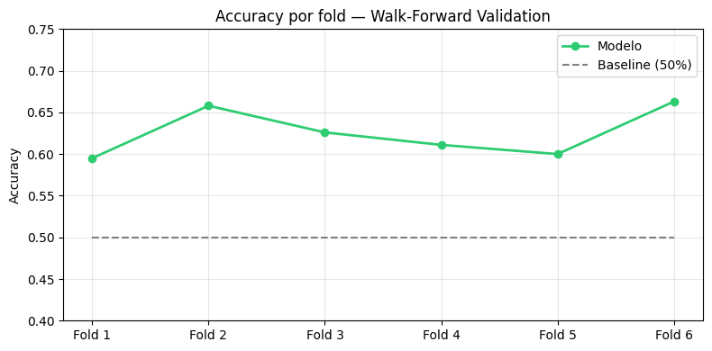
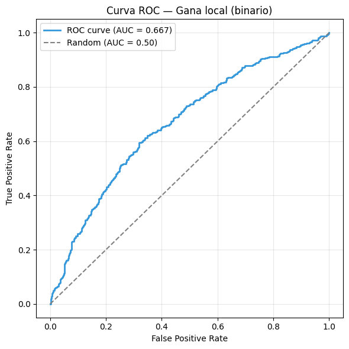
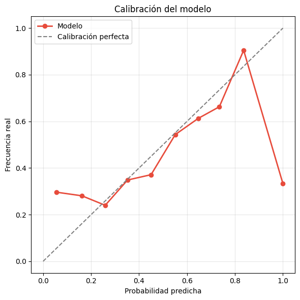
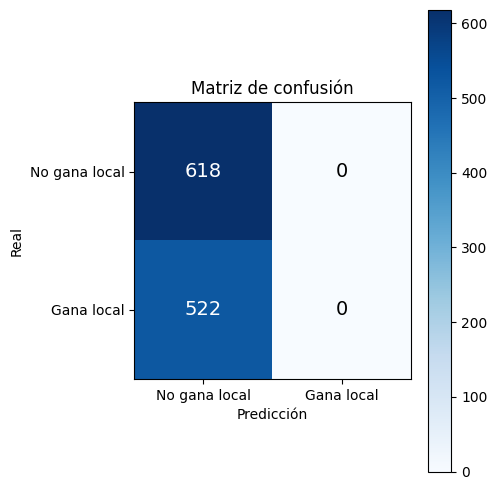
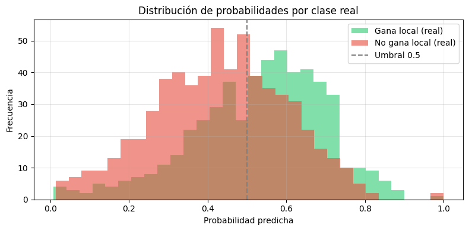
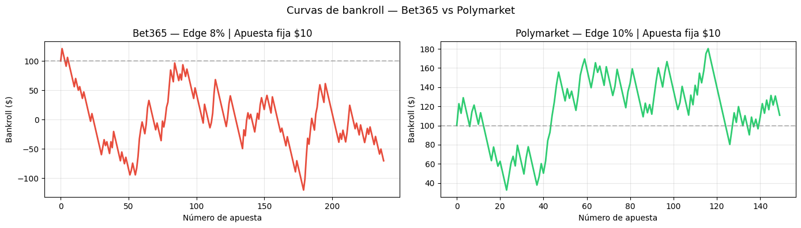

# ⚽ Football Match Predictor — Polymarket Edition

Modelo de deep learning para predecir victorias de equipos locales en la Premier League,
orientado a detectar value bets en mercados de predicción descentralizados como Polymarket.

---

## 📌 Problema

Los mercados de apuestas deportivas como Bet365 son altamente eficientes — sus odds
incorporan información pública rápidamente. Sin embargo, mercados descentralizados como
Polymarket presentan mayor ineficiencia, lo que abre oportunidades para modelos predictivos
con edge estadístico real.

---

## 🏗️ Arquitectura del modelo

Modelo con **3 inputs simultáneos** usando Keras Functional API:

```
Secuencia local (10 partidos)  →  LSTM(32)  ─┐
Secuencia visitante (10 part.) →  LSTM(32)  ─┼→ Dense(64) → Dropout(0.3) → Dense(1, sigmoid)
Stats escalares (18 features)  →  Dense(32) ─┘
```

**¿Por qué LSTM?**
Los resultados de un equipo son una serie temporal — el modelo necesita capturar
momentum, rachas y tendencias recientes, no solo promedios estáticos.

**Output:** Probabilidad binaria de victoria local (0-1)

---

## 📊 Features utilizadas

| Feature | Descripción |
|---|---|
| Secuencia de resultados | Últimos 10 partidos codificados como 1/0/-1 |
| Goles promedio | Media de goles a favor y en contra (últimos 10) |
| Rachas | Partidos sin perder / sin ganar consecutivos |
| Posición en tabla | Posición normalizada en el momento del partido |
| H2H | Historial directo entre los dos equipos |
| Días de descanso | Días desde el último partido de cada equipo |
| Probabilidades implícitas | Odds de Bet365 sin margen de la casa |

---

## 📈 Resultados

### Walk-Forward Validation (6 folds, 1140 partidos evaluados)





| Métrica | Valor | Referencia |
|---|---|---|
| Accuracy | **62.5%** | Random = 50% |
| AUC | **0.6486** | Random = 0.50 |
| Brier Score | **0.2365** | Random ≈ 0.25 |

### Curva ROC





### Calibración





### Distribución de probabilidades





### Matriz de confusión





---

## 💰 Backtesting

### ¿Por qué Bet365 no funciona?

En Bet365 las odds de favoritos locales son tan bajas (1.30-1.50) que el punto
de equilibrio exige >67-77% de accuracy. El modelo con 62.5% no alcanza ese umbral.

### ¿Por qué Polymarket sí funciona?

Polymarket tiene margen de ~2% (vs 6% de Bet365) y precios más equilibrados.
Con un precio de $0.55, el punto de equilibrio es 55% — el modelo con 62.5% supera ese umbral.





### Resultados Polymarket (apuesta fija $10)

| Edge mínimo | Apuestas | Win Rate | ROI | Profit |
|---|---|---|---|---|
| 3% | 322 | 45.3% | +1.23% | +$39.70 |
| 5% | 270 | 43.7% | +0.08% | +$2.17 |
| 8% | 187 | 42.8% | +0.43% | +$8.04 |
| **10%** | **113** | **48.7%** | **+10.64%** | **+$120.18** |

**Estrategia óptima:** apostar $10 fijos cuando edge ≥ 10% → ROI +10.64% sobre 113 apuestas.

---

## 🛠️ Stack tecnológico

- **TensorFlow / Keras** — arquitectura LSTM + Functional API
- **Pandas / NumPy** — feature engineering y manejo de datos
- **Scikit-learn** — métricas, class weights, calibración
- **Matplotlib** — visualizaciones
- **Datos:** [football-data.co.uk](https://www.football-data.co.uk) — 5 temporadas Premier League (1900 partidos)

---

## 🚀 Cómo correr el proyecto

1. Abrir `AgenteFutbol.ipynb` en Google Colab
2. Correr las celdas en orden (1 → 7)
3. La celda 3 tarda ~2 minutos por el feature engineering
4. La celda 5 tarda ~5 minutos por el walk-forward

---

## 📁 Estructura

```
football-predictor/
├── AgenteFutbol.ipynb     # notebook principal
├── accuracy_folds.png
├── roc_curve.png
├── calibration.png
├── prob_distribution.png
├── bankroll_comparison.png
└── confusion_matrix.png
└── README.md
```

---

## ⚠️ Limitaciones y trabajo futuro

- Los datos públicos de football-data.co.uk no incluyen alineaciones ni lesiones
- El backtesting de Polymarket usa precios estimados desde odds de Bet365, no precios reales de Polymarket
- Trabajo futuro: integrar API de Polymarket para backtesting con precios reales
